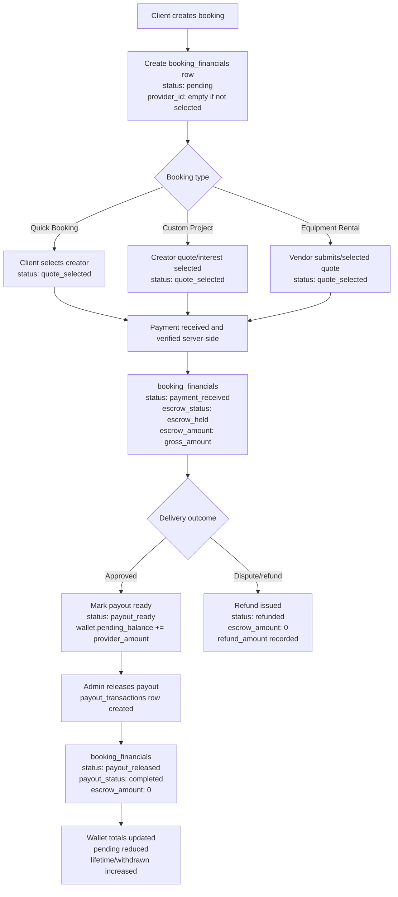

# ShotcutCrew Financial Lifecycle

## Finance Record Shape

Every booking finance row carries the canonical finance fields plus launch-facing compatibility fields:

- `booking_id`
- `customer_id`
- `provider_id`
- `booking_type`
- `gross_amount`
- `platform_commission`
- `provider_amount`
- `escrow_amount`
- `status`

The admin finance dashboard reads from `booking_financials` and `payout_transactions`; it does not calculate totals from booking UI state.
